# 2026-daviweb-dario

## Resumen del Propósito
Aplicación web orientada a la gestión integral de citas y servicios para negocios de cuidado personal y peluquerías. La plataforma permite a los clientes consultar la oferta de servicios, conocer al personal del centro, comprobar la disponibilidad en tiempo real y reservar citas de forma personalizada, mientras que el negocio dispone de un panel para la administración de agenda, catálogo y métricas analíticas.

## Estado del Proyecto
> **Aviso de Estado:** Actualmente solo se han definido los objetivos funcionales y los objetivos técnicos de la aplicación. La fase de desarrollo e implementación del software aún no ha comenzado.

---

## Objetivos

### Objetivos Funcionales
La aplicación busca digitalizar el flujo de trabajo de un centro de estética/peluquería facilitando la interacción entre cliente y negocio.

* **Consulta pública de catálogo y equipo:** Permitir a usuarios anónimos navegar por los servicios ofertados, precios, duración estimada e información del personal.
* **Gestión de reservas online:** Posibilitar que los usuarios registrados programen, consulten y cancelen citas de forma autónoma.
* **Confirmaciones e historial:** Enviar notificaciones/comprobantes de reserva y mantener un historial de citas atendidas por cliente.
* **Panel de administración:** Proporcionar al administrador herramientas para la gestión de servicios, horarios de empleados y visualización de analíticas de rendimiento del negocio.

### Objetivos Técnicos
La aplicación se desarrollará con una arquitectura SPA + API REST en la nube, utilizando las siguientes tecnologías:

* **Frontend:** Aplicación SPA (Single Page Application).
* **Backend:** API REST desarrollada en Java con Spring Boot.
* **Base de Datos:** PostgreSQL para persistencia de datos relacionales.
* **Cloud & Infraestructura:** Amazon Web Services (AWS) utilizando AWS RDS (PostgreSQL) para la base de datos gestionada y AWS S3 para el almacenamiento de archivos multimedia/imágenes.
* **Empaquetado y Contenedores:** Empaquetado mediante Docker y orquestación local/despliegue con Docker Compose.
* **Integración Continua:** GitHub Actions para el pipeline de CI/CD.

#### Partes Optativas Seleccionadas:
1. **Despliegue integrado con servicios Cloud (AWS S3, RDS):** Integración directa del backend con el SDK de AWS para almacenamiento persistente de imágenes en S3 y base de datos relacional PostgreSQL gestionada en AWS RDS.
2. **Pruebas automáticas unitarias y de integración:** Implementación de pruebas unitarias y de integración tanto en backend como en frontend.

---

## Metodología y Planificación

El proyecto se desarrollará siguiendo una metodología iterativa e incremental dividida en 7 fases con fechas límite máximas de entrega.

> **Nota sobre el calendario:** Las fechas indicadas representan la estimación máxima de entrega para cada hito académico. El desarrollo de cada fase se inicia inmediatamente al concluir la anterior, habiéndose completado la Fase 1 con la publicación del primer informe técnico el 22 de julio.

| Fase | Descripción | Fecha Límite |
| :--- | :--- | :--- |
| **Fase 1** | Definición de funcionalidades y pantallas | 22 de Julio |
| **Fase 2** | Repositorio, pruebas y CI | 15 de Septiembre |
| **Fase 3** | Versión 0.1 - Funcionalidad básica y Docker | 15 de Noviembre |
| **Fase 4** | Versión 0.2 - Funcionalidad intermedia | 31 de Enero |
| **Fase 5** | Versión 1.0 - Funcionalidad avanzada | 15 de Marzo |
| **Fase 6** | Memoria | 30 de Abril |
| **Fase 7** | Defensa del TFG | Mayo / Junio |

### Diagrama de Gantt

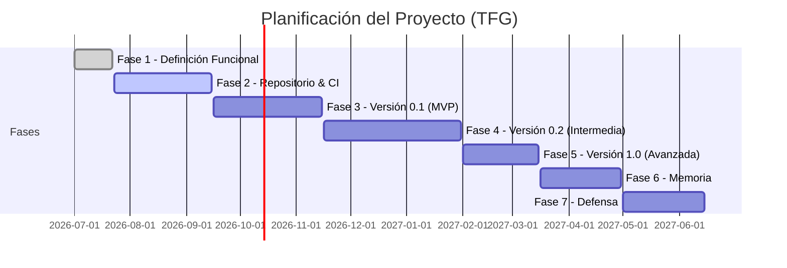
```mermaid
gantt
    dateFormat  YYYY-MM-DD
    title Planificación del Proyecto (TFG)
    
    section Fases
    Fase 1 - Definición Funcional        :done, f1, 2026-07-01, 2026-07-22
    Fase 2 - Repositorio & CI            :active, f2, 2026-07-23, 2026-09-15
    Fase 3 - Versión 0.1 (MVP)           :f3, 2026-09-16, 2026-11-15
    Fase 4 - Versión 0.2 (Intermedia)    :f4, 2026-11-16, 2027-01-31
    Fase 5 - Versión 1.0 (Avanzada)      :f5, 2027-02-01, 2027-03-15
    Fase 6 - Memoria                     :f6, 2027-03-16, 2027-04-30
    Fase 7 - Defensa                     :f7, 2027-05-01, 2027-06-15
```

---

## Funcionalidades Detalladas

Las funcionalidades de la aplicación se desarrollan de forma iterativa e incremental, clasificadas según su prioridad de entrega y el tipo de usuario al que van dirigidas:

### Funcionalidad Básica (MVP - Versión 0.1 / Fase 3)
* **Usuario Anónimo:**
  * Visualización de la página principal (Home) con información resumida del centro.
  * Consulta del catálogo público de servicios (cortes, precios, duración).
  * Acceso a la sección de Ubicación y Contacto con mapa interactivo de Google Maps.
  * Consulta de los profesionales disponibles en el local.
  * Consulta de la sección de Preguntas Frecuentes (FAQ).
* **Usuario Registrado:**
  * Autenticación mediante formulario de inicio de sesión (Login).
  * Consulta de servicios recientes para repetir reserva fácilmente.
  * Proceso básico de reserva de cita seleccionando servicio, fecha y tramo horario.
* **Administrador:**
  * Autenticación con credenciales de administrador para acceder a las vistas privadas.
  * Acceso al calendario de administrador para la consulta global de citas registradas.

### Funcionalidad Intermedia (Versión 0.2 / Fase 4)
* **Usuario Anónimo:**
  * Navegación por la galería pública "Fotos del Día" con vista ampliada de imágenes.
  * Consulta de las secciones informativas "Sobre Nosotros" y reseñas de clientes (Opiniones).
* **Usuario Registrado:**
  * Acceso al panel personal para consultar citas pasadas y reservas pendientes.
  * Opción de cancelación o modificación de reservas dentro del plazo permitido.
* **Administrador:**
  * **Gestión de Servicios y Cortes:** Crear, editar, personalizar (intervalos de tiempo, variaciones según largo del pelo, límites horarios) y eliminar servicios del catálogo.
  * **Gestión de Galería:** Administración y subida de imágenes expuestas en la sección "Fotos del día".
  * **Información General y Horarios:** Configuración de días semanales de apertura, tramos horarios comerciales y definición de días especiales/excepciones (festivos o cierres concretos).

### Funcionalidad Avanzada (Versión 1.0 / Fase 5)
* **Usuario Registrado:**
  * Elección de profesional/estilista preferido durante el proceso de reserva.
  * Recepción de correos electrónicos automáticos con la confirmación y detalles de la reserva.
* **Administrador:**
  * **Gestión del Equipo Profesional:** Alta, edición y control de visibilidad pública del personal del local.
  * **Gestión de Lista Negra y Faltas:** Bloqueo de números de teléfono de usuarios problemáticos y registro visual de ausencias en el calendario.
  * **Panel de Analítica (Charts):** Visualización mediante gráficos interactivos de métricas clave (citas mensuales, servicios más demandados y tasa de faltas).

---

## Análisis de la Aplicación

### Pantallas y Navegación

A continuación se describen las pantallas de la aplicación y el flujo de navegación entre ellas:

1. **Pantalla de Usuario / Inicio (Home):**
   * *Imagen:* 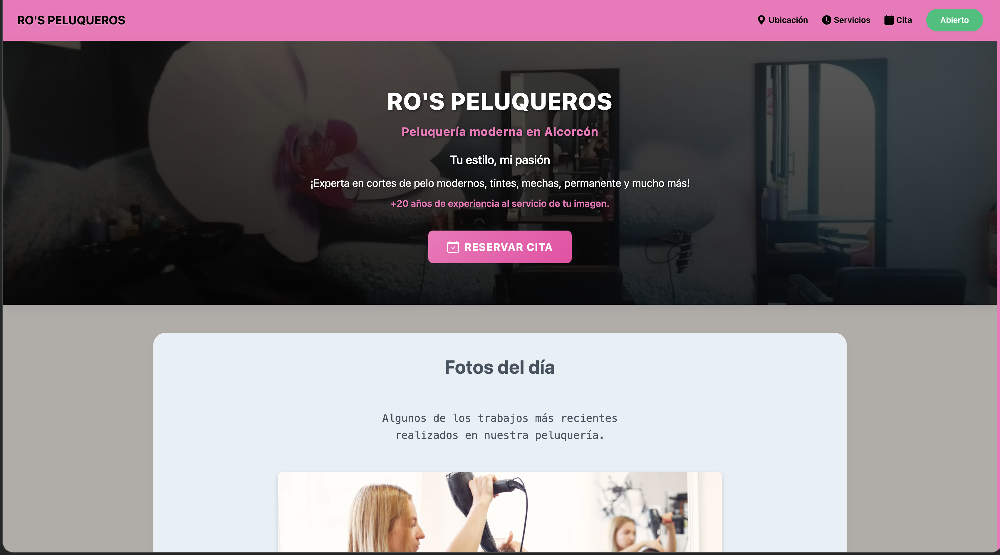
   * *Descripción:* Muestra información muy breve sobre el negocio y ofrece botones que desplazan a las funciones principales para un usuario (reservar, ubicación, servicios...). 
   * *Acceso a:* Formulario de Registro/Login, Detalle de Servicio, Pantalla de Reserva, Ubicación del local.
      * *Nota: En la barra de navegación superior se añadirá un apartado para iniciar sesión o registrarse como usuario.*

2. **Pantalla de Usuario / Fotos del Día:**
   * *Imagen:* 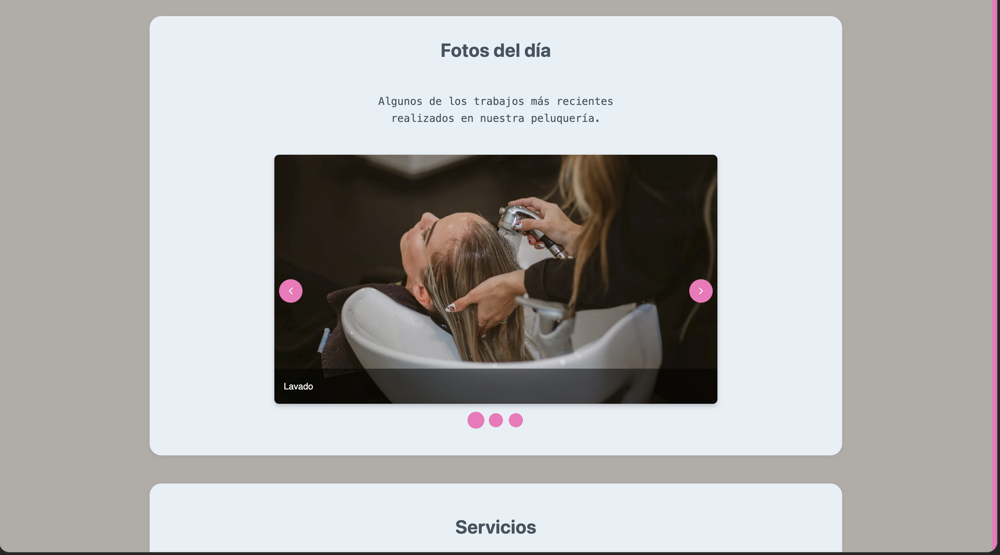
   * *Descripción:* Muestra imágenes del local, de cortes recientes o cualquier ilustración que incentive reservar.
   * *Acceso a:* Vista ampliada de imagen (Modal/Lightbox)

3. **Pantalla de Usuario / Servicios:**
   * *Imagen:* 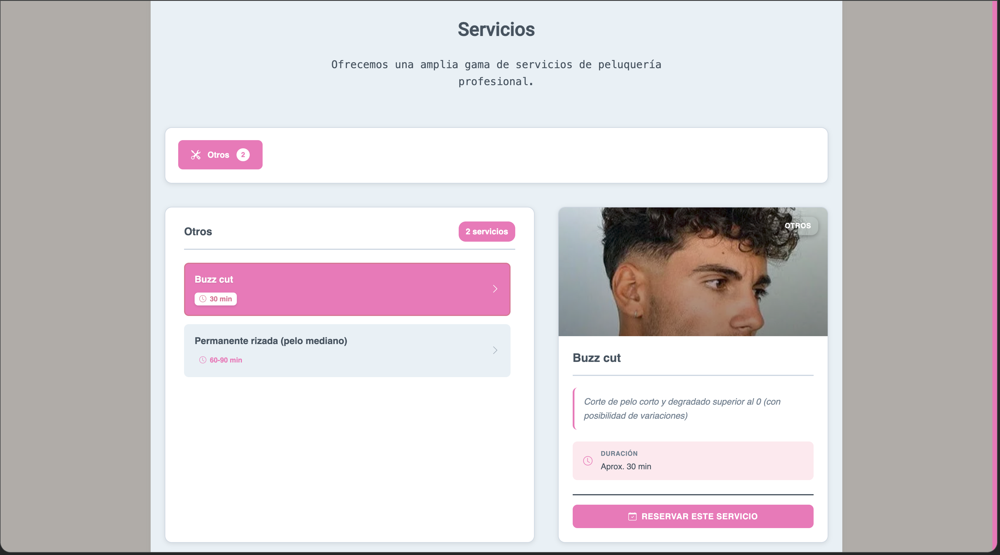
   * *Descripción:* Muestra el catálogo ofrecido por el local (cortes, tintes...) junto a una descripción e información relevante para el usuario y la reserva.
   * *Acceso a:* Reserva automáticamente personalizada al servicio seleccionado (ajustado al corte).

4. **Pantalla de Usuario / Equipo Profesional:**
   * *Imagen:* 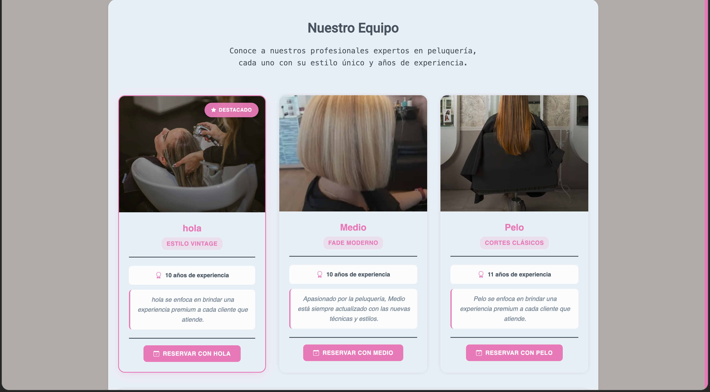
   * *Descripción:* Muestra el equipo de trabajo del local, permitiendo (según la configuración interna) la elección del usuario para su cita.
   * *Acceso a:* Reserva automáticamente personalizada al servicio seleccionado (ajustado al profesional).
      * *Nota: La visibilidad de este apartado es seleccionable por el administrador.*

5. **Pantalla de Usuario / Calendario de reservas:**
   * *Imágenes:* 
      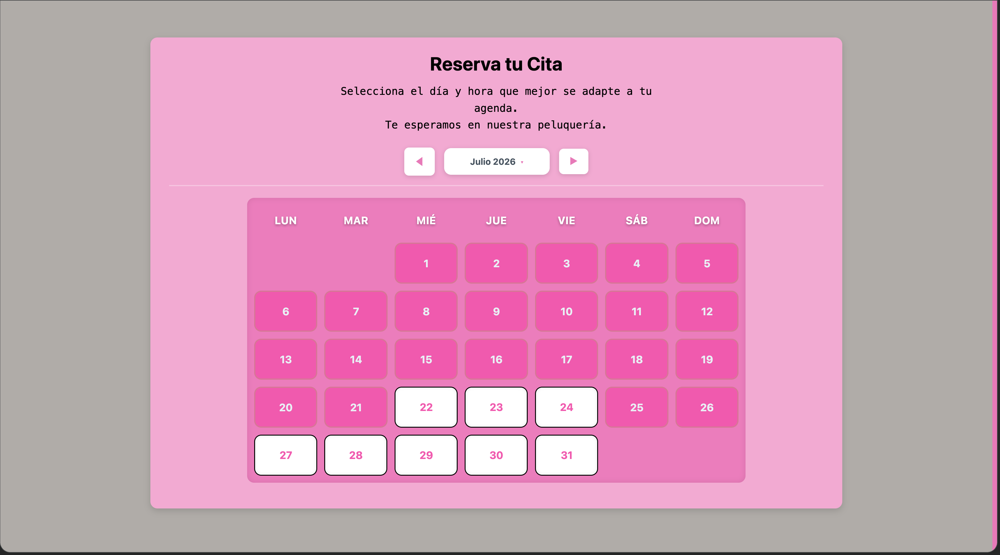
      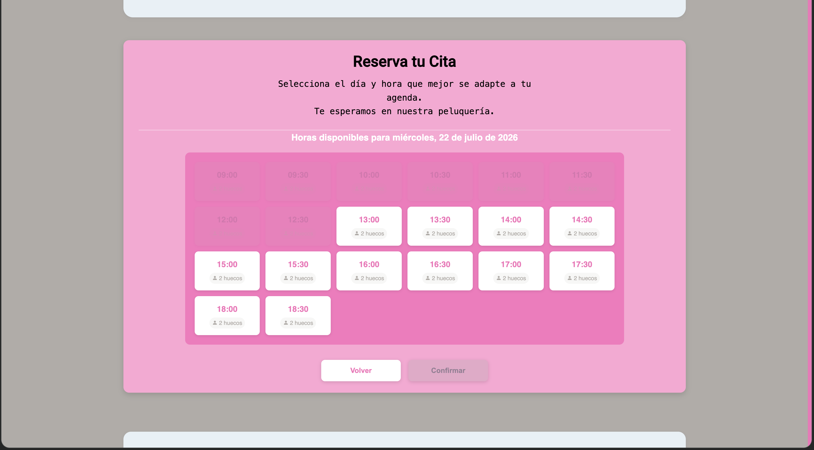
      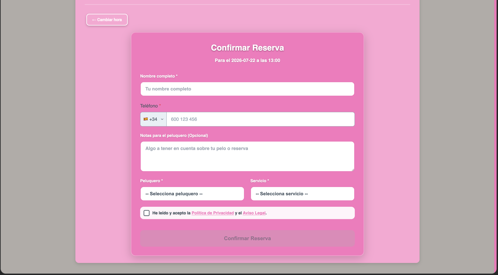
   * *Descripción:* 
      * Muestra el calendario con los días disponibles resaltados. 
      * Cuando se selecciona el día el calendario cambia a las horas disponibles (si está activada la opción del equipo profesional, aparecerán los profesionales disponibles a esa hora). 
      * Cuando se ha seleccionado el día y la hora aparecerá un formulario con la información necesaria para la reserva.
   * *Acceso a:* Formulario de reserva e información de la reserva.

6. **Pantalla de Usuario / Ubicación y Contacto:**
   * **Imagen:** 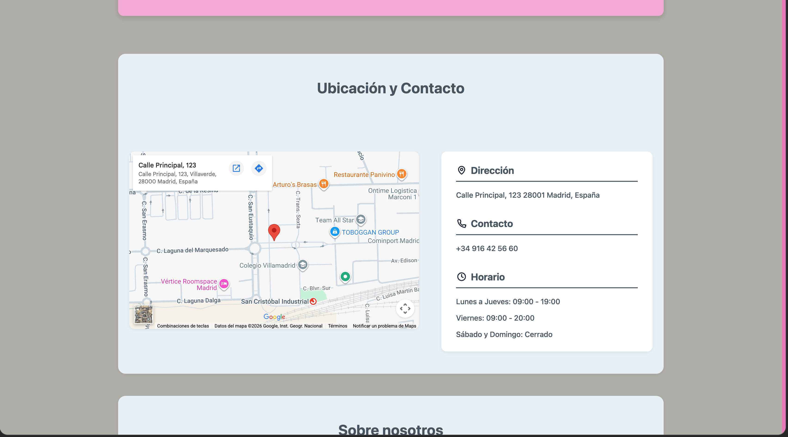
   * **Descripción:** Muestra la localización exacta del local mediante un mapa interactivo de Google Maps, junto con la dirección física, teléfono, horario comercial y canales de contacto.
   * **Acceso a:** Aplicación externa de Google Maps (Cómo llegar), Enlaces directos de contacto (Teléfono/Email), Redes sociales del negocio, Módulo de Reserva de Cita.

7. **Pantalla de Usuario / Sobre Nosotros:**
   * **Imagen:** 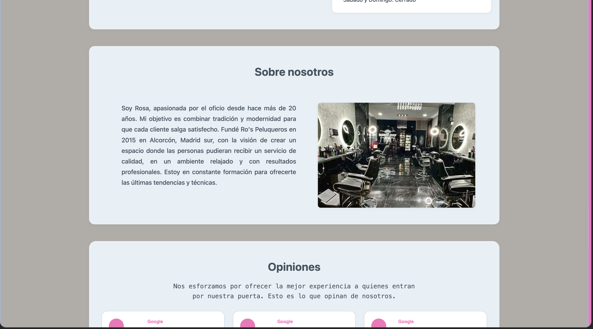
   * **Descripción:** Sección informativa que presenta la trayectoria profesional del equipo del local, la historia del centro y una fotografía del interior del local.
   * **Acceso a:** Ninguno (Sección puramente informativa).

8. **Pantalla de Usuario / Opiniones:**
   * *Imagen:* 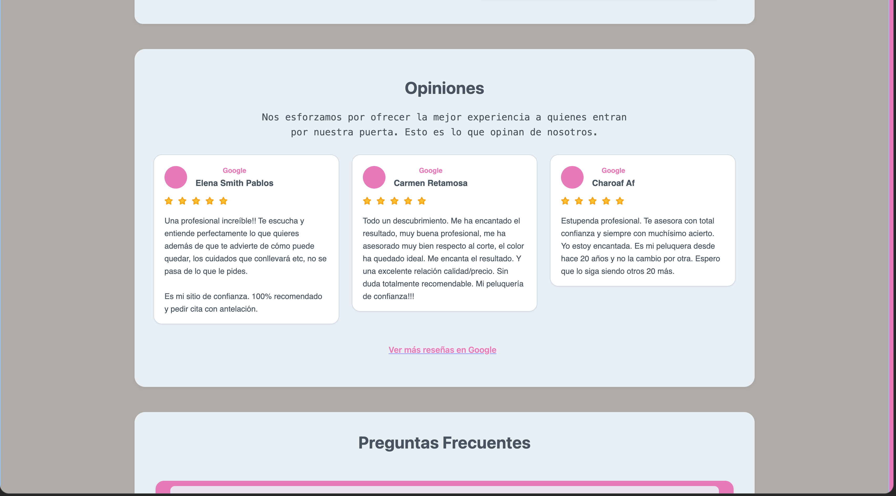
   * *Descripción:* Muestra diferentes valoraciones de la gente en las reseñas de google.
   * *Acceso a:* Reseñas de google sobre el local.

9. **Pantalla de Usuario / Preguntas Frecuentes:**
   * *Imagen:* 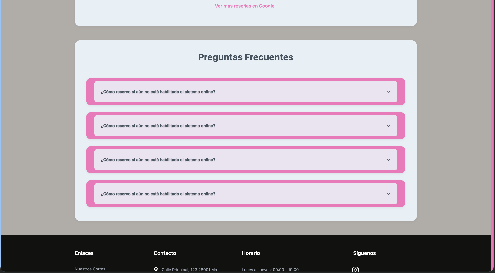
   * *Descripción:* Muestra preguntas frecuentes sobre el estado del negocio, la gestión e información relevante con sus respectivas respuestas.
   * *Acceso a:* Ninguno (Sección puramente informativa).

10. **Pantalla de inicio de sesión:**
   * *Imagen:* 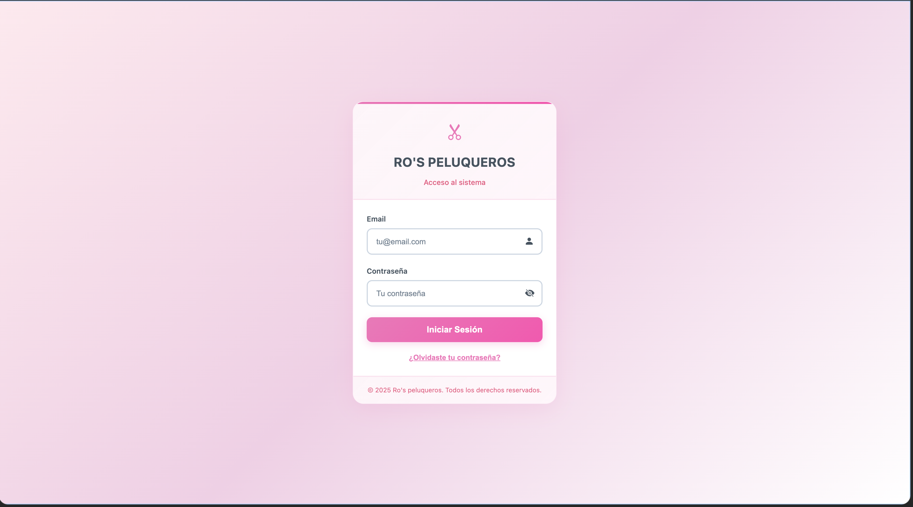
   * *Descripción:* Muestra el formulario de inicio de sesión (falta el de registro).
   * *Acceso a:* Panel de administración (iniciando como administrador) y panel de usuario (iniciando como usuario).

11. **Panel de administración / Galería de Fotos:**
   * *Imagen:* 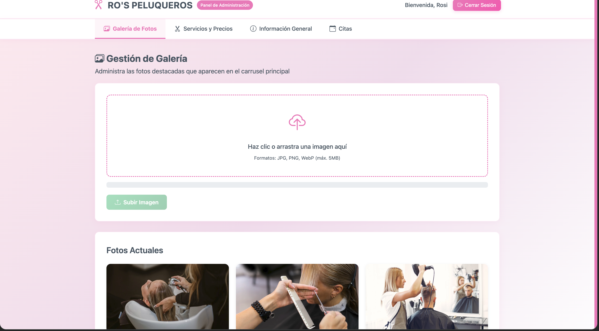
   * *Descripción:* Muestra las imágenes ilustradas en las fotos del día.
   * *Acceso a:* Gestión de imágenes mostradas en "Fotos del día".

12. **Panel de administración / Servicios y Cortes:**
   * *Imagen:* 
      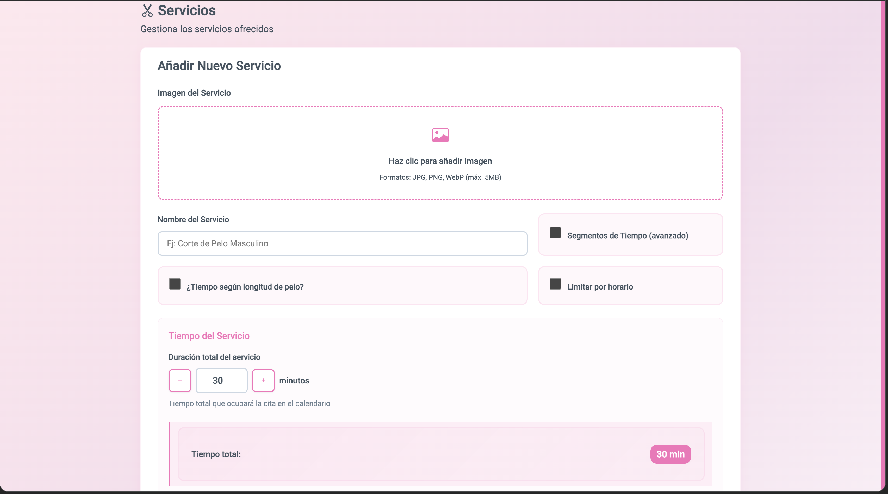
      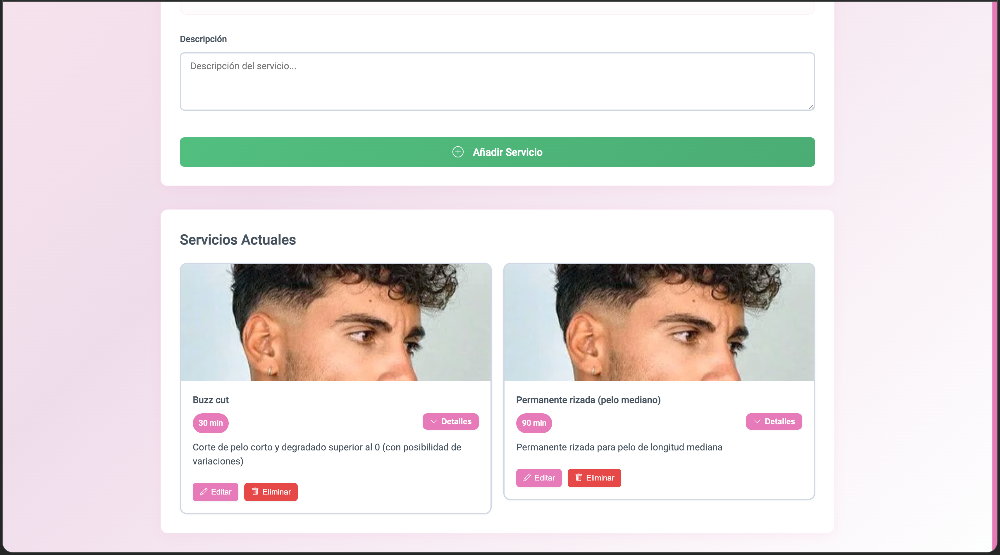 
   * *Descripción:* Muestra el formulario de creación de servicios con diversas personalizaciones (intervalos de tiempo, variación según longitud del pelo, límite horario para el servicio) y los servicios activos (se pueden editar o eliminar).
   * *Acceso a:* Manipulación de servicios disponibles.

13. **Panel de administración / Información General:**
   * *Imagen:* 
      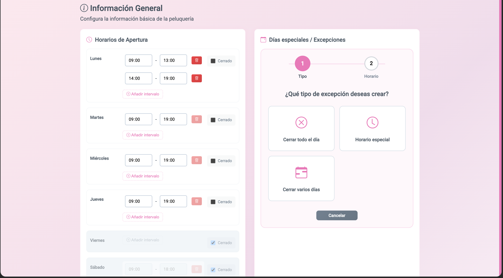
      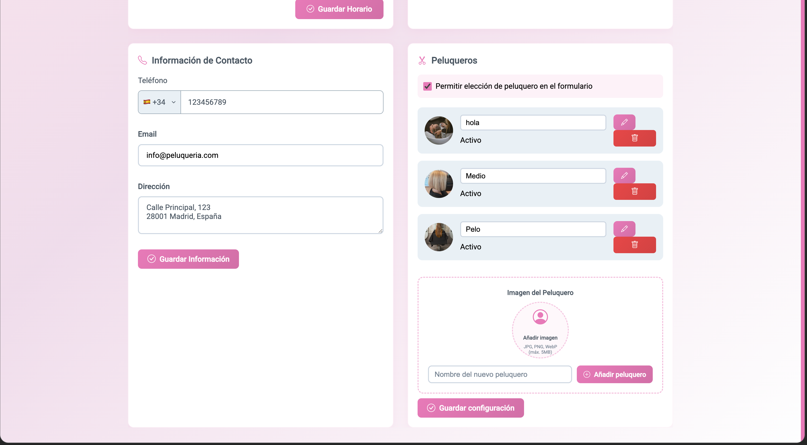 
   * *Descripción:* 
      * Muestra un apartado con los días de la semana para poder personalizar el horario y añadir intervalos. 
      * Tiene un apartado de días especiales y excepciones, para abrir o cerrar en un momento concreto fuera del horario habitual. 
      * Abajo tiene un apartado para modificar la información de contacto que se muestra del local y configurar los ajustes del personal (mostrar o no mostrar al personal, nombre e imagen del profesional).
   * *Acceso a:* Manipulación de información relevante sobre el negocio.

14. **Panel de administración / Calendario de Administrador:**
   * *Imagen:* 
      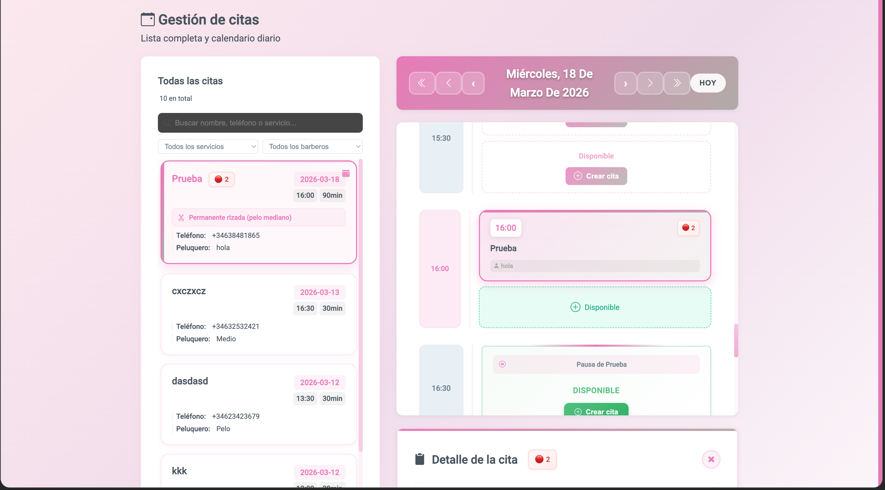
      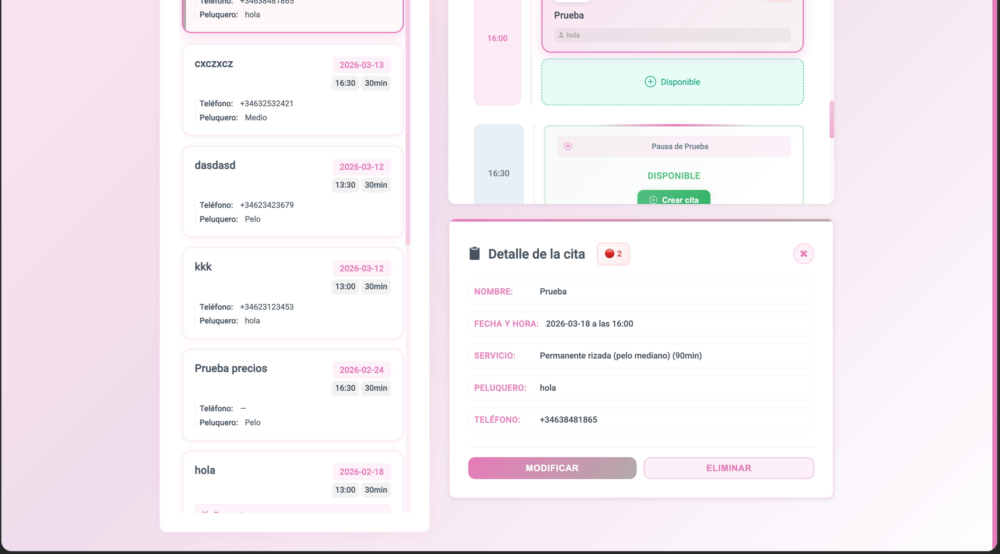 
      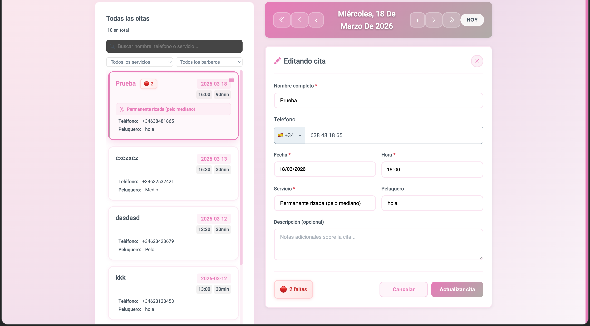 
   * *Descripción:* Muestra un calendario para consultar las citas pendientes y añadir, editar o eliminar manualmente citas por parte del administrador. Si un usuario ha faltado a alguna cita, se verá reflejado con un círculo rojo y el número de veces que ha faltado.
   * *Acceso a:* Manipulación de citas por parte del administrador.

15. **Panel de administración / Lista Negra:**
   * *Imagen:* 
      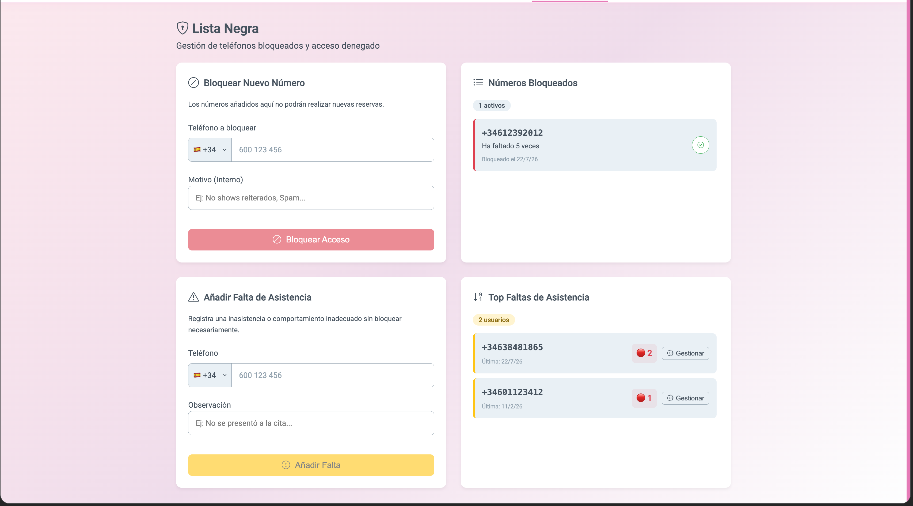
   * *Descripción:* 
      * Muestra un apartado para bloquear números de teléfono y otro para ver qué números hay bloqueados.
      * Muestra otro apartado para apuntar y consultar las faltas de asistencia de los usuarios (estas se muestran en el calendario del administrador).
   * *Acceso a:* Gestión de usuarios problemáticos.

### Entidades del Dominio

La aplicación gestionará 4 entidades principales interrelacionadas en la base de datos PostgreSQL:

1. **Usuario (`User`):**
   * **Descripción:** Representa a los usuarios del sistema (clientes registrados y administradores).
   * **Atributos:** `id`, `fullName`, `email`, `password`, `phoneNumber`, `role`, `profilePictureUrl`, `noShowCount`.
   * **Relaciones:** Un `User` puede tener asociadas varias reservas (`Appointment` 1:N).

2. **Servicio (`Service`):**
   * **Descripción:** Tratamientos o cortes del catálogo con soporte de tiempos dinámicos según longitud del cabello y tramos horarios.
   * **Atributos:** `id`, `name`, `description`, `basePrice`, `imageUrl`, `requiresHairLength`, `hairLengthModifiers`, `timeSegments`, `limitedBySchedule`.
   * **Relaciones:** Un `Service` puede estar presente en varias reservas (`Appointment` 1:N).

3. **Empleado (`Employee`):**
   * **Descripción:** Personal profesional o estilistas de la peluquería encargados de realizar los servicios.
   * **Atributos:** `id`, `fullName`, `specialty`, `imageUrl`, `isAvailable`.
   * **Relaciones:** Un `Employee` puede atender varias reservas (`Appointment` 1:N).

4. **Reserva / Cita (`Appointment`):**
   * **Descripción:** Registro central de la reserva de un servicio para una fecha, hora y estilista determinados.
   * **Atributos:** `id`, `date`, `hairLengthChoice`, `priceAtBooking`, `paymentStatus`, `cancelationToken`, `createdAt`.
   * **Relaciones:** Pertenece a un `User` (o cliente invitado), está asociada a un `Service` y asignada a un `Employee`.

### Permisos de Usuarios (Control de Acceso)

El sistema implementa un control de acceso basado en roles (RBAC) estructurado en tres niveles de permisos:

| Funcionalidad / Módulo | Usuario Anónimo | Cliente Registrado | Administrador |
| :--- | :---: | :---: | :---: |
| Consultar catálogo de servicios y precios | **Sí** | **Sí** | **Sí** |
| Consultar información de local y mapa | **Sí** | **Sí** | **Sí** |
| Reservar cita previa | **Sí** | **Sí** | **Sí** |
| Cancelar cita mediante enlace/token directo | **Sí** | **Sí** | **Sí** |
| Iniciar sesión / Registrarse | **Sí** | - | - |
| Gestionar perfil y consultar historial de citas | - | **Sí** | **Sí** |
| Cancelar cita desde el panel privado | - | **Sí** | **Sí** |
| Gestión del catálogo (Crear/Editar/Eliminar servicios) | - | - | **Sí** |
| Gestión del equipo (Crear/Editar/Eliminar empleados) | - | - | **Sí** |
| Panel de métricas y estadísticas de negocio | - | - | **Sí** |
| Control de asistencia y registro de *No-Shows* | - | - | **Sí** |

### Justificación de Requisitos Obligatorios

1. **Gestión e Integración de Imágenes:**
   * **Servicio Utilizado:** Amazon Web Services (AWS S3).
   * **Aplicación:** Almacenamiento dinámico de las imágenes de perfil de los usuarios (`User`), las fotografías de los empleados (`Employee`) y las portadas del catálogo de cortes (`Service`).

2. **Representación Gráfica / Estadísticas:**
   * **Servicio / Librería Utilizada:** Chart.js / Recharts.
   * **Aplicación:** Dashboard del Administrador con gráficos interactivos que muestran métricas de ingresos, distribución de citas por empleado y los servicios más demandados por mes.

3. **Geolocalización y Mapas:**
   * **API Utilizada:** Google Maps JavaScript API / Embed API.
   * **Aplicación:** Integración de un mapa interactivo en la sección de *Ubicación y Contacto* para facilitar al cliente el cálculo de rutas e indicaciones hacia la peluquería.

4. **Algoritmo Complejo de Negocio:**
   * **Algoritmo de Cálculo de Disponibilidad Horaria (Slots):**
     * Cálculo dinámico de huecos libres sin solapamientos en tiempo real.
     * Toma en cuenta la duración variable del servicio según la longitud del cabello (`hairLengthModifiers`), la segmentación del tiempo en tramos de trabajo y descansos (`timeSegments`), los horarios comerciales del local y las citas ya existentes de cada estilista.

---

## Seguimiento del Proyecto

* **Blog de Desarrollo (Medium):** [Perfil de medium](https://medium.com/@dariogarciagomez01)
   * [Entrada 1: Planificación inicial, roles y diseño de arquitectura (Fase 1)](https://medium.com/@dariogarciagomez01/daviweb-digital-management-and-booking-system-for-personal-care-centers-phase-1-planning-613f2a6a26ec)
* **Gestión de Tareas:** Tablero Kanban disponible en [GitHub Projects](https://github.com/codeurjc-students/2026-daviweb-dario/projects)

---

## Autores y Contexto Académico

Esta aplicación web se desarrolla como **Trabajo de Fin de Grado (TFG)** del Grado en Ingeniería del Software en la Escuela Técnica Superior de Ingeniería Informática (**ETSII**) de la **Universidad Rey Juan Carlos (URJC)**.

* **Alumno:** Darío García Gómez
* **Tutor:** Óscar Soto Sánchez